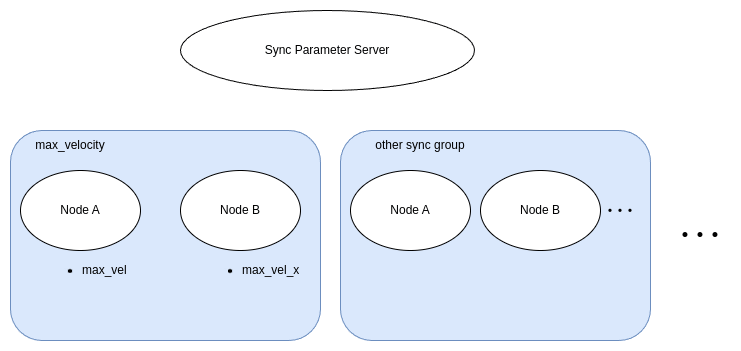

# sync_parameter_server

ROS2 package for managing the synchronization of parameters between multiple nodes.

This package provides synchronization of parameter values between ROS2 parameters.
While ROS2 allows for dynamic changes of parameters, the management of these parameters is done on a per-node basis.
Therefore, even if they are set to maintain relationships with parameters of other nodes by default, depending on how they are used, these relationships can be disrupted.
This package addresses this issue by having the [SyncParameterServer](./src/sync_parameter_server.cc) handle parameter change events and synchronize them with parameters of other registered nodes, thereby enhancing the system's adaptability to dynamic changes in parameters.

Furthermore, by setting up the [SyncParameterServer](./src/sync_parameter_server.cc), it is possible to clarify the dependencies between parameters.
This can make it easier for users to understand the intentions of the parameter adjusters.

## SyncParameterServer

The [SyncParameterServer](./src/sync_parameter_server.cc) is a class that manages the synchronization of parameters between multiple nodes.
If the default value is changed using the `set_parameters` service call to this node, the parameters to be synchronized with other nodes will also be changed.

### Parameter

- `sync_parameters` (`string_array`, default: `[]`): Group names of parameters to be synchronized.
- `[sync_group_name].params` (`string_array`, default: `[]`): Parameter names to be synchronized. The parameter name is specified in the form of `path/to/node/parameter_name`.
- `[sync_group_name].type` (`string`, default: `''`): Type of parameter to be synchronized. The type of parameter is available in the following types.
  - `bool`
  - `integer`
  - `double`
  - `string`
  - `bool_array`
  - `integer_array`
  - `double_array`
  - `string_array`
- `[sync_group_name].default` (any): Default value of parameter to be synchronized.
- `[sync_group_name].[parameter_name].scale` (`double`, default: `1.0`, optional): Scaling factor of parameter to be synchronized. This parameter is only valid if `[sync_group_name].type` is `double` or `integer`.
- `[sync_group_name].[parameter_name].offset` (`double`, default: `0.0`, optional): Offset of parameter to be synchronized. This parameter is only valid if `[sync_group_name].type` is `double` or `integer`.

Please refer to [sample.yaml](./config/sample.yaml) for the sample.
